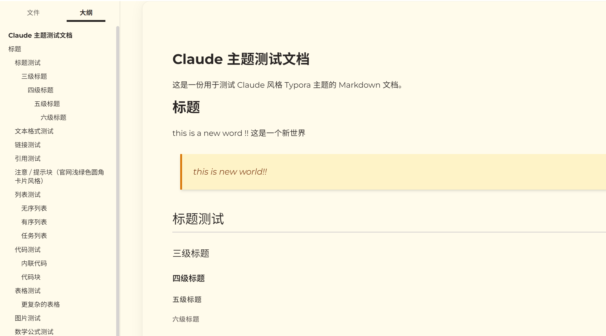

# Claude Style Themes

面向多种 Markdown / 笔记应用的 Claude 风格主题合集。

这个仓库保持 theme-first 的最小结构，不引入额外构建链。核心就是把同一套 Claude 风格的暖纸面、陶土强调色、Montserrat 排版和编辑稿式界面语言迁移到不同 app。

## 当前支持

| 应用 | 主题 | 状态 | 路径 |
|------|------|------|------|
| Typora | Claude | 主线维护 | [`themes/typora/claude/`](themes/typora/claude/) |
| Obsidian | Claude | 主线维护 | [`themes/obsidian/claude/`](themes/obsidian/claude/) |
| Obsidian | WizNote | legacy，手动安装保留 | [`themes/obsidian/wiznote/`](themes/obsidian/wiznote/) |

## 效果预览

### Typora - Claude



## 一键安装

仓库根目录提供一个轻量 Python 脚本 [`install.py`](install.py)，直接复制主题文件，不做额外打包。

### Typora

```bash
python install.py typora
```

如果需要指定 Typora 主题目录：

```bash
python install.py typora --target-dir "C:\path\to\Typora\themes"
```

### Obsidian

```bash
python install.py obsidian --vault "/path/to/your/vault"
```

如需覆盖已有主题文件，可以追加：

```bash
python install.py obsidian --vault "/path/to/your/vault" --force
```

## 手动安装

### Typora - Claude

将 [`themes/typora/claude/claude.css`](themes/typora/claude/claude.css) 和 [`themes/typora/claude/claude-dark.css`](themes/typora/claude/claude-dark.css) 复制到 Typora 主题目录。

- Windows: `%APPDATA%\Typora\themes\`
- macOS: `~/Library/Application Support/abnerworks.Typora/themes/`
- Linux: `~/.config/Typora/themes/`

`claude-dark.css` 会 `@import` `claude.css`，所以这两个文件需要一起复制。

### Obsidian - Claude

将 [`themes/obsidian/claude/theme.css`](themes/obsidian/claude/theme.css) 和 [`themes/obsidian/claude/manifest.json`](themes/obsidian/claude/manifest.json) 复制到：

```text
<vault>/.obsidian/themes/Claude/
```

然后在 `设置 -> 外观 -> 主题` 中选择 **Claude**。

### Obsidian - WizNote

WizNote 主题暂时保留在仓库中，但不进入主线安装脚本。需要时可继续手动复制 [`themes/obsidian/wiznote/`](themes/obsidian/wiznote/) 目录下的文件。

## 项目结构

```text
claude-style-themes/
├── install.py
├── themes/
│   ├── typora/
│   │   └── claude/
│   └── obsidian/
│       ├── claude/
│       └── wiznote/
├── tests/
└── README.md
```

## 开发与验证

```bash
python -m unittest tests.test_install -v
python themes/typora/claude/test/test_theme.py
python themes/obsidian/claude/test/test_theme.py
```

## 许可证

Apache License 2.0
