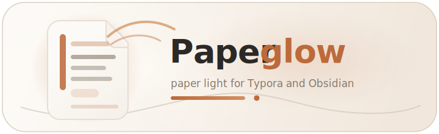
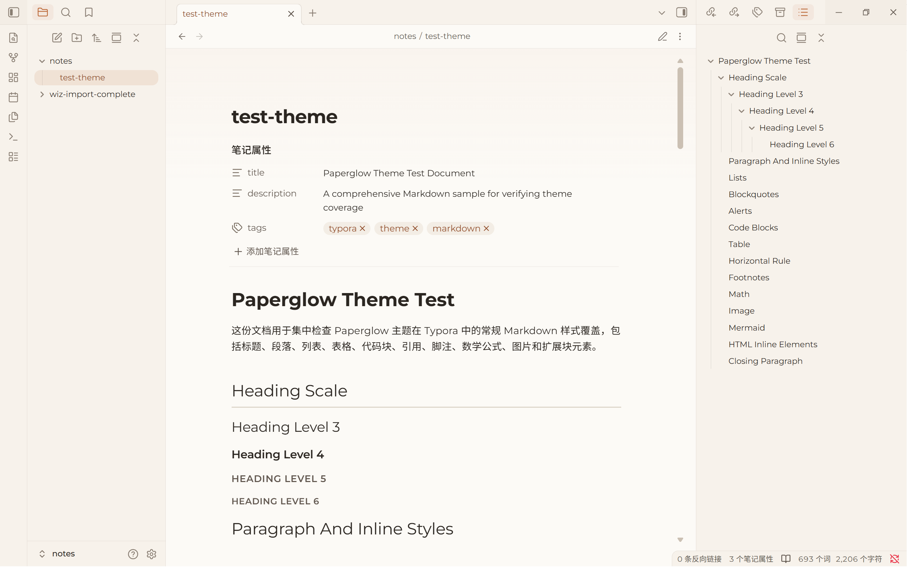
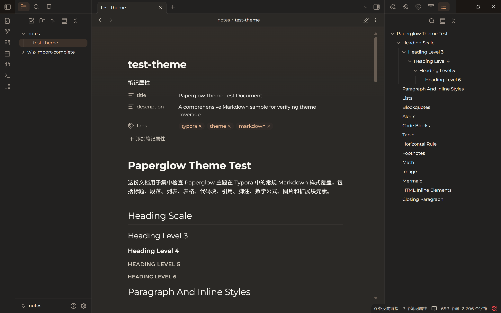
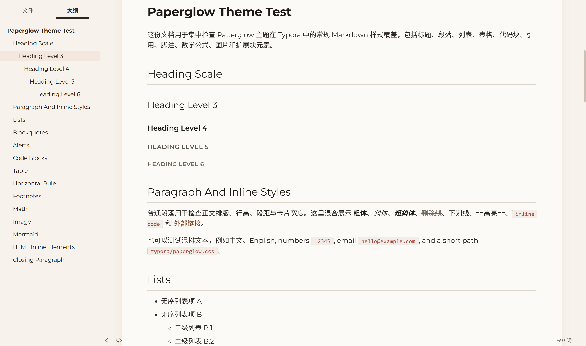
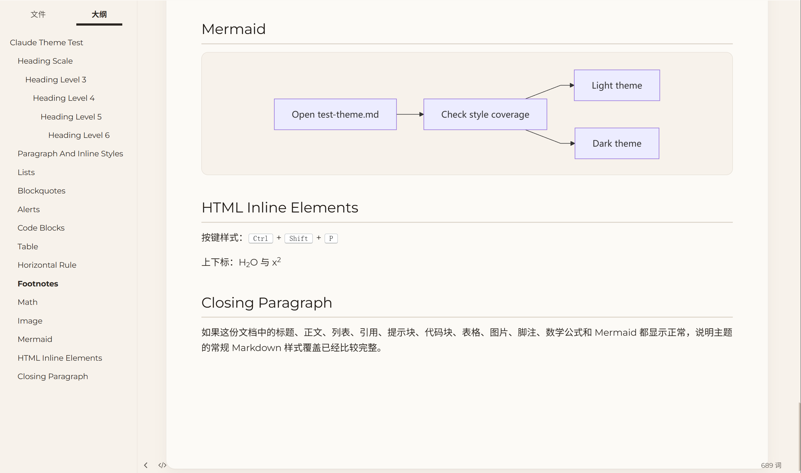
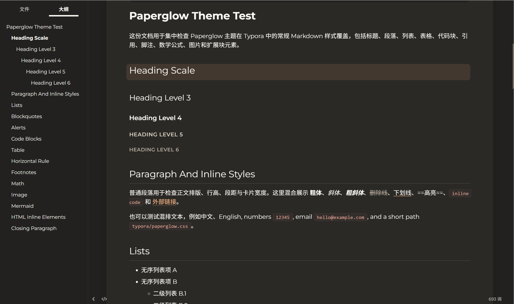
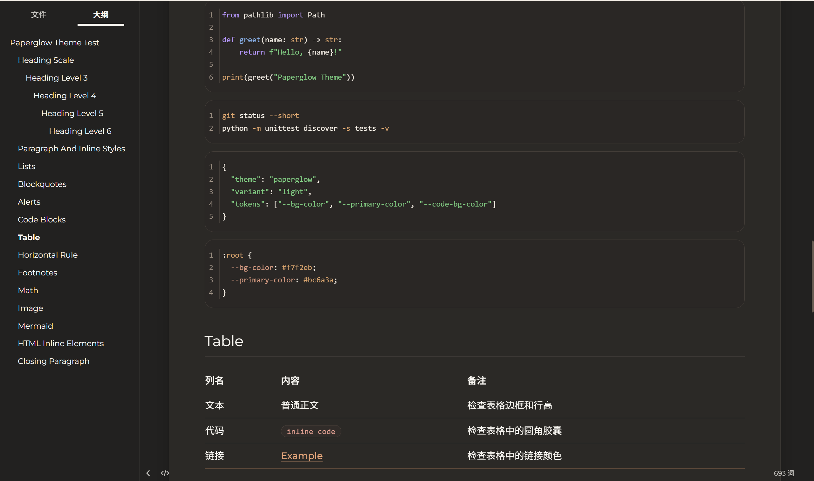

<p align="center">
  
</p>

<p align="center">
  
  
  
</p>


简体中文 | [English](README.en.md)

# Paperglow Theme

> 雨在窗外洗出一帧泛黄的过场 你拧亮桌角　铜锈里酿出的昏黄
>
> 从书架抽出一截　被布面缝住的时光 翻开 纸页漫出蜂蜜酿的光
>
> 指腹摩挲而过　像替谁抚平折了一半的衷肠 油墨安静卧在字间　不急着对谁声张
>
> 段落间的留白　是呼吸落脚的道场 你没注意排版
>
> 你只是顺着墨香　读进一条回不了头的长廊 窗外那场雨也在读你 等你合上书　它刚好落完最后一行

---

这套主题的设计理念很简单：把那个下雨天、那盏灯、那张纸还给你。

背景不是屏幕白，是日光晒过的书页。未漂白的棉纸，带着一点点奶黄，一点点温度。你盯着它看十分钟不会觉得刺眼，就像盯着一本摊开的旧书。到了夜里，它翻过一面，变成深夜书房的色调：不是程序员终端那种冰冷的纯黑，而是台灯光圈之外、书架木头上沉下去的那层暗棕。柔和的，安静的，让你的瞳孔不必在明暗之间反复挣扎。

正文区浮在窗口上方，像一张摊开的稿纸。圆角收边，投影极淡。纸总是比桌面亮一点的。你的视线会被这张卡片自然地收拢，世界缩小到文字和你之间。

强调色取自窑变的陶土。不是那些急于表现自己的荧光色，而是一种烧过的暖橘，出现在链接、标签、引用块的左边线上，像你在书页空白处用老钢笔留下的一道批注。它不抢眼，但你每次视线扫过，都会知道那里有东西值得回来看。

字体只有一个。Montserrat，几何无衬线，从极细到粗体贯穿所有场景。标题用最轻的笔触写，正文用最舒服的字重读，界面用最安静的灰度退到背后。不是没想过加第二种字体，是不需要。一支好笔够写所有的字，靠的是运笔轻重，不是换笔。中文落在 Noto Sans SC 上，代码交给 JetBrains Mono，各得其所。

排版讲究节奏。表格对齐极细分隔线风格，引用块是暖灰的圆角容器配一条陶土左线，代码块安静地蹲在圆角的暗底里。每一个元素都在说同一句话：你好，我在这里，但我不打扰你。

这些颜色、间距、字重、圆角，最终指向同一件事：

**让你忘掉你在用电脑写字。**

---

## 🎨 预览

### Obsidian

<p align="center">
  
</p>

<p align="center">
  
</p>

### Typora

<table>
  <tr>
    <td></td>
    <td></td>
  </tr>
  <tr>
    <td></td>
    <td></td>
  </tr>
  <tr>
    <td></td>
    <td></td>
  </tr>
</table>

## 📦 支持的应用

| 应用 | 主题 | 状态 | 路径 |
|------|------|------|------|
| Obsidian | Paperglow | ✅ 主线维护 | [`theme.css`](theme.css) + [`manifest.json`](manifest.json) |
| Typora | Paperglow | ✅ 主线维护 | [`typora/`](typora/) |

## 🚀 安装

仓库根目录有一个轻量安装脚本 [`install.py`](install.py)，一行命令，不做额外打包。

### Obsidian

```bash
python install.py obsidian
```

脚本会自动检测所有 vault 并安装。指定单个 vault：

```bash
python install.py obsidian --vault "/path/to/your/vault"
```

### Typora

```bash
python install.py typora
```

指定主题目录：

```bash
python install.py typora --target-dir "C:\path\to\Typora\themes"
```

## 🔧 手动安装

### Obsidian

将 [`theme.css`](theme.css) 和 [`manifest.json`](manifest.json) 复制到 `<vault>/.obsidian/themes/Paperglow/`，然后在 **设置 → 外观 → 主题** 中选择 **Paperglow**。

### Typora

将 [`paperglow.css`](typora/paperglow.css) 和 [`paperglow-dark.css`](typora/paperglow-dark.css) 一起复制到主题目录。`paperglow-dark.css` 会 `@import` `./paperglow.css`，所以两个文件必须同时存在。

| 系统 | 路径 |
|------|------|
| Windows | `%APPDATA%\Typora\themes\` |
| macOS | `~/Library/Application Support/abnerworks.Typora/themes/` |
| Linux | `~/.config/Typora/themes/` |

## 💡 补充说明

### Typora Windows Unibody 标题栏

Typora 主题 CSS 可以覆盖正文区、侧栏、搜索面板和部分 HTML UI，但 Windows 默认窗口样式下最上方菜单栏是系统原生控件，不会被主题改色。如果希望顶部区域也跟随 Paperglow，请在 Typora 的 **Settings / 偏好设置 → Appearance / 外观 → Window Style** 中切换到 **Unibody**，然后重启 Typora。

### Obsidian 特性

- 统一 Montserrat / Noto Sans SC / JetBrains Mono 字体体系
- 亮色暖纸面与夜间深墨两套语义配色
- 阅读区与编辑区都使用更贴近纸面稿件的卡片式阅读容器
- 16px 圆角代码块、暖灰引用块、陶土色链接与统一 callout 视觉

## 🏗️ 项目结构

```text
paperglow/
├── install.py                 # 安装脚本：支持 Obsidian / Typora
├── manifest.json              # Obsidian 主题清单
├── screenshot.png             # Obsidian 社区主题预览图
├── theme.css                  # Obsidian 主题入口文件
├── versions.json              # Obsidian 主题版本兼容映射
├── typora/                    # Typora 主题文件
│   ├── paperglow.css          # Typora 浅色主题
│   └── paperglow-dark.css     # Typora 深色主题，会 import paperglow.css
├── docs/
│   ├── logo.svg               # 项目 logo
│   ├── typora/                # Typora 预览图
│   └── obsidian/              # Obsidian 预览图
├── tests/                     # 安装、文档、Obsidian 与 Typora 样式检查
├── README.md                  # 中文文档
└── README.en.md               # English documentation
```

## 🧪 验证

```bash
python -m unittest discover -s tests -v
```

## 📄 许可证

Apache License 2.0
